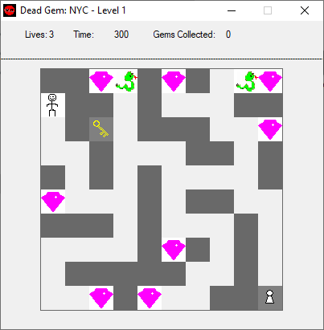

# Vondido

Chip's Challenge inspired puzzle game written in AutoIt scripting language circa 2007. "Vondido" was the codename.

# Original ReadMe (2006)

## Dead Gem: NYC V1.1.3

First off, I WILL TRY MY BEST TO MAKE SURE THAT EACH LEVEL IS 100% BEATABLE.  I have recorded my times for each of the current levels.

Level 1 - 24 seconds
Level 2 - 27 seconds

~~~~~~~~~~~~~~~~~~~~~~~~~~~~~~~~~~~~~~~~~~~~~~~~~~~~~~~~~~~~~~~~~~~~~~~~~~~~~~~~

Hello, and thank you for reading this.  Dead Gem: New York City, and named after and created by Dandymcgee (Dan Bechard).  This is the ReadMe file.  Any distribution of this software is currently free, but this MUST remain with the program UNEDITED.  Under no circumstances is this to be claimed as your own, as it is not.  Nor, at this point in time, is it to be redistributed for a sum or fee.  By using this program, you hereby agree to all of the aforementioned terms, and may continue reading the instructions to this game.

~~~~~~~~~~~~~~~~~~~~~~~~~~~~~~~~~~~~~~~~~~~~~~~~~~~~~~~~~~~~~~~~~~~~~~~~~~~~~~~~

To start a new game simply start playing!

Person: The little Pokemon guy is you.  Move around by using the Arrow Keys (Up, Down, Left, Right).
Gems: These are the blue & white items that look like diamonds or jewels.  You must collect all of these to pass to the next level.
Keys: There is usually only one key in each level, and along with the gems, you must have the key to pass to the next level.
Ghosts: These are bad.  Each time you hit a ghost you lose a life and restart the level.
Lives: You have 3 lives.  If you die three times, that's a Game Over and you will be sent back to the first level of the game.

~~~~~~~~~~~~~~~~~~~~~~~~~~~~~~~~~~~~~~~~~~~~~~~~~~~~~~~~~~~~~~~~~~~~~~~~~~~~~~~~~

I know there is still a whole ton of work left for me to do in the programming aspect of this game, but for now this is pretty much a "trial" version.  It was completely my own unique idea, and the name was also a very lucky coincidence.  I hope you enjoy this "trial" version, and I hope to be realeasing an actual realease some time before December, although I can't promise anything, as it takes a very long time to create each unique level.  As I make more levels they are going to need to get harder, so it will take a bit longer.  Hopefully, if I have enough time, I can start making the levels 20 by 20 versus the current 10 by 10.  Thank You for trying my game, and have a nice day!

Constant updates at my website (below) be sure to visit me often and leave a nice little comment in the guestbook.  Thanks!

~~~~~~~~~~~~~~~~~~~~~~~~~~~~~~~~~~~~~~~~~~~~~~~~~~~~~~~~~~~~~~~~~~~~~~~~~~~~~~~~~~~~~~~~~~~~

Dead Gem: NYC
By: Dandymcgee  <dandymcgee123@yahoo.com>

## Credits

- Many thanks to Dethredic for supplying the pictures and many awesome ideas for upcoming   features in my game.
- Also to theguy0000 for his many ideas.
